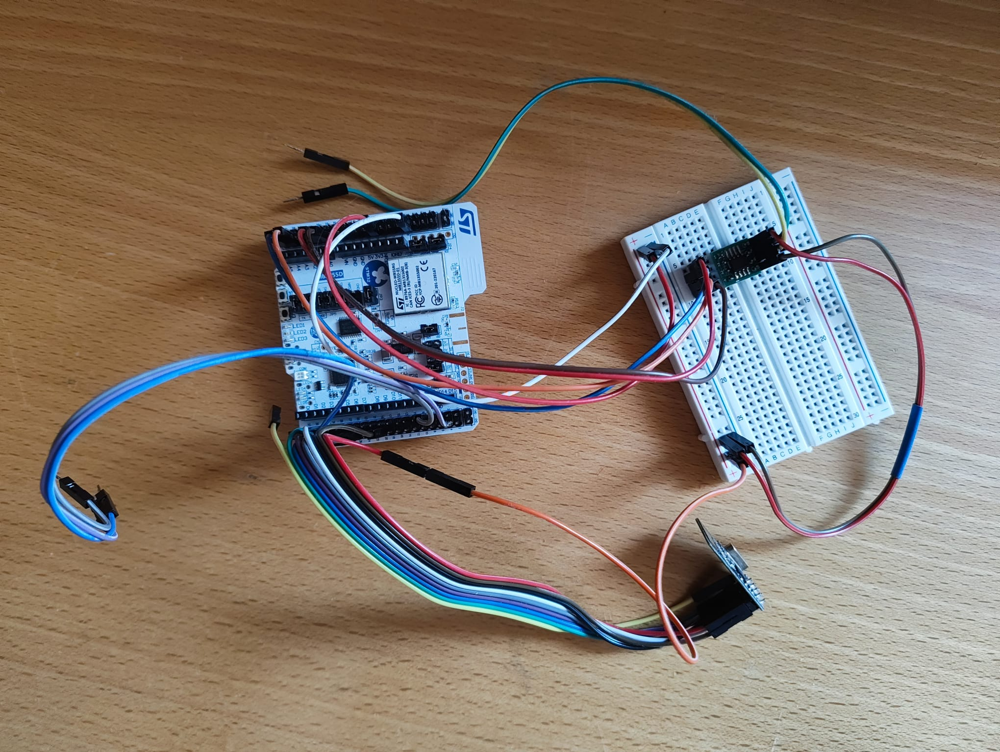
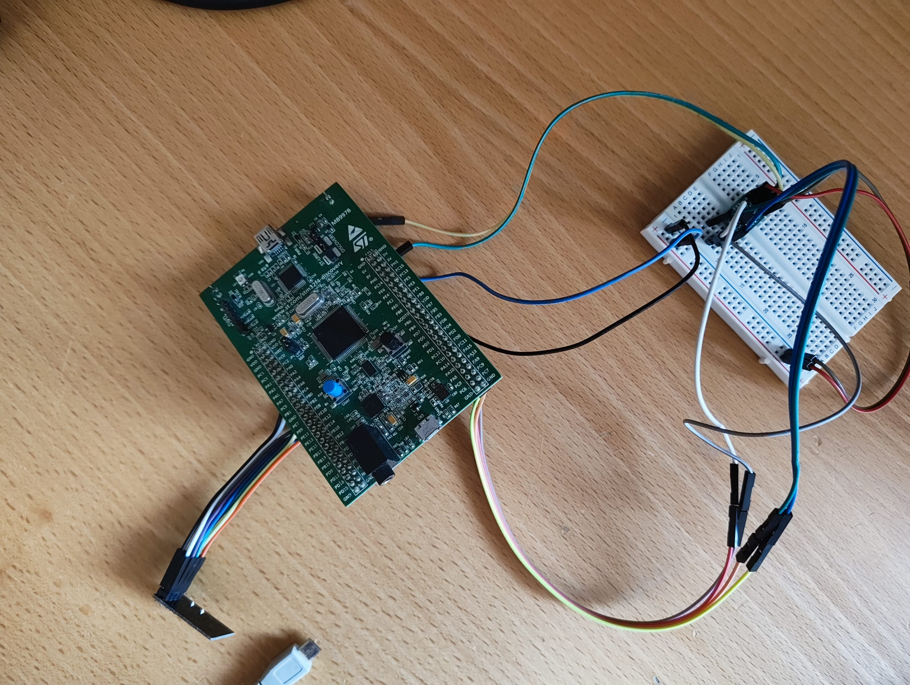
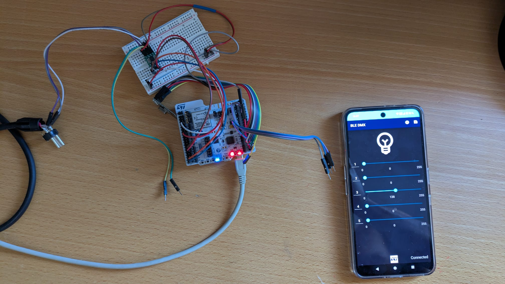
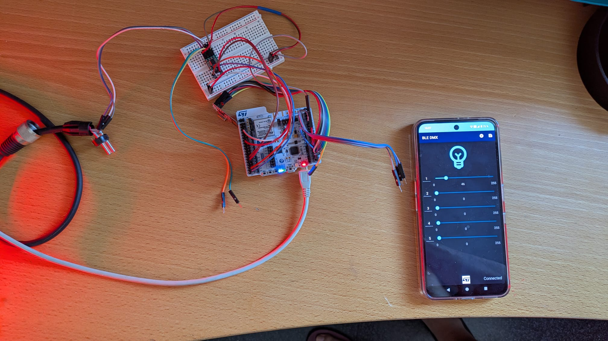
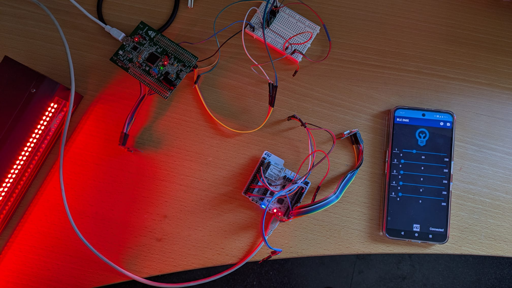

# DMX512 Wireless Controller (Prototype)

This project is a **prototype implementation** of a wireless DMX512 control system using **STM32 microcontrollers** and **NRF24L01 modules**. It is based on the [STM32WB-BLE-Dev-App-Android](https://github.com/stm32-hotspot/STM32WB-BLE-Dev-App-Android ) repository, which serves as the foundation for the mobile application. This is my first GitHub repository, and it focuses on the **development boards and components** rather than the final device.

---

## 🧩 Hardware Components

### **Nucleo-STM32WB55RG (Master Board)**
- **Purpose**: Acts as the central controller for DMX512 signal generation and BLE communication.
- **Key Features**:
  - Integrated Bluetooth Low Energy (BLE) for mobile device connectivity.
  - Configured with **USART** for DMX512 signal output.
  - Uses **NRF24L01** for wireless communication with slave devices.
  - Includes **SP3485EN-L** for RS-485 signal conversion.
  - **Used for testing and validating the DMX512 protocol**.

### **STM32F4-Discovery (Slave Board)**
- **Purpose**: Simulates a DMX512 slave device for testing.
- **Key Features**:
  - Communicates with the master via **NRF24L01**.
  - Uses **SPI** for NRF24L01 integration.
  - Implements **DMX512 signal generation** through the **SP3485EN-L** transceiver.
  - **Used for verifying the wireless communication protocol**.

---

## 🛠️ Development Boards Used

- **Nucleo-STM32WB55RG**: For the master device (BLE and DMX512 signal generation).
- **STM32F4-Discovery**: For the slave device (NRF24L01 communication and DMX512 signal simulation).

---

## 💡 Features

- **BLE Communication**: Based on the [STM32WB-BLE-Dev-App-Android](https://github.com/stm32-hotspot/STM32WB-BLE-Dev-App-Android ) app.
- **Wireless DMX512 Control**: Uses NRF24L01 modules for master-slave communication.
- **Modular Design**: Separate code for master and slave boards.
- **Open Source**: Code and documentation for hardware and software are available for educational and experimental purposes.

---
## 🧪 Testing and Validation

- **Proff of Concept**: The system was tested using the **Nucleo-STM32WB55RG** (master) and **STM32F4-Discovery** (slave).
- **Signal Generation**: DMX512 signals were validated using an oscilloscope and MATLAB analysis.
- **Wireless Communication**: NRF24L01 modules were used to simulate multi-slave scenarios.

---

## 📌 Notes

- This repository does **not include the final device** but focuses on **development boards** and **component integration**.
- The mobile app is a **modified version** of the [STM32WB-BLE-Dev-App-Android](https://github.com/stm32-hotspot/STM32WB-BLE-Dev-App-Android ).
- The code is intended for **educational and experimental use** and may require adjustments for production.

---

## 📷 Images

Below are some key images of the prototype and its components:

   
    <em>Master Board (STM32WB55RG)</em>

   
    <em>Slave Board (STM32F4-Discovery)</em>

   
    <em>Master Board Connected to the app</em>

   
    <em>Master Board conected to a light</em>

   
    <em>Slave Board with conected to a light</em>

---

## 📚 References

- [STM32WB55RG Datasheet](https://www.st.com/en/microcontrollers-microprocessors/stm32wb55rg.html )
- [STM32F4-Discovery User Manual](https://www.st.com/en/evaluation-tools/stm32f4discovery.html )
- [NRF24L01 Product Specification](https://cdn.sparkfun.com/datasheets/Wireless/Nordic/nRF24L01_Product_Specification_v2_0.pdf )
- [DMX512 Standard (ANSI E1.11)](https://tsp.esta.org/tsp/documents/docs/ANSI-ESTA_E1-11_2008R2018.pdf )

---

## 📝 License

This project is licensed under the MIT License. See the [LICENSE](LICENSE) file for details.

---

## 📢 Contact

For questions or feedback, please open an issue on GitHub or contact me at [morancho-guillermo@hotmail.com](mailto:morancho-guillermo@hotmail.com).
